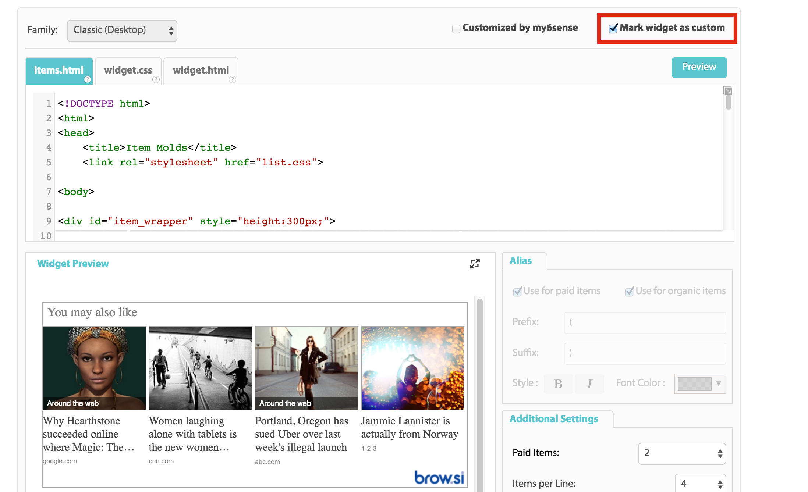

############
Introduction
############

This document briefly explains how to define the UI of a content recommendations widget using HTML & CSS.

Custom Widget
^^^^^^^^^^^^^
* A “Custom Widget” is a widget that is originated from a (simplified version of a) generic widget and its code was edited by the application user.
* Currently only the classic and infeed families supports code customization by the user.
* To switch to code customization mode, check the “Mark widget as custom” option.
* General properties such as number of items in widget and number of paid items are editable as well.

